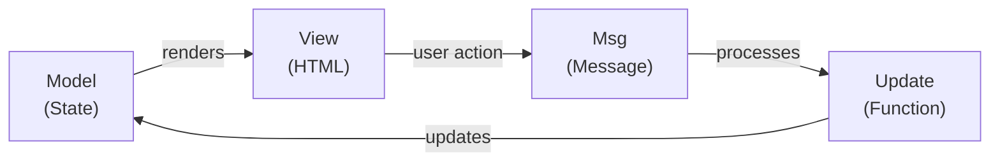

# Course Images

This directory contains images used throughout the SelfLearning course.

## Images to Add

### `elmModel.png`
**Location:** `assets/images/elmModel.png`
**Used in:** `docs/elm/mvu-architecture.md`
**Description:** Visual diagram showing the MVU (Model-View-Update) architecture flow

**How to create:**
1. Go to [Mermaid Live Editor](https://mermaid.live)
2. Paste this code:

3. Click **Download** → Save as PNG → `elmModel.png`
4. Place the file in this directory (`assets/images/`)
5. Commit and push:
```bash
git add assets/images/elmModel.png
git commit -m "Add MVU architecture diagram"
git push
```

## Image Naming Convention

- Use **camelCase** for image names
- Include descriptive names: `elmModel.png`, not `diagram.png`
- Optimize PNG/JPG files for web before adding
- Keep file sizes reasonable (< 500KB recommended)

## Directory Structure

```
assets/
├── css/
│   └── style.scss
└── images/
    ├── README.md (this file)
    ├── elmModel.png
    └── (other images...)
```

## Tips

- Use [TinyPNG](https://tinypng.com) to compress images
- Test images render properly on both desktop and mobile
- Use descriptive alt text in markdown: ``
