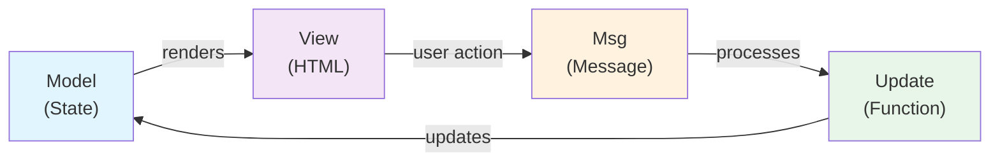

# MVU Architecture - Model View Update

[← Back to Course Home](../../)

## What is MVU?

MVU (Model-View-Update) is an elegant architecture pattern for building interactive applications. It provides a clear structure for managing application state and responding to user interactions. This pattern originated in Elm and has influenced many modern frameworks.

## The Three Components

The MVU pattern consists of three core parts that work together:

### 1. Model

The **Model** represents all the data in your application at any given moment.

```
Model = Application State
```

**Key concepts:**
- Single source of truth for all application data
- Describes what information your app needs to remember
- Examples: user profile, list items, form inputs, current page

**Example:**
```elm
type alias Model =
  { name : String
  , age : Int
  , email : String
  , count : Int
  }
```

### 2. View

The **View** is how users see and interact with your data.

```
View = Model → HTML
```

**Key concepts:**
- Transforms your Model into visual elements
- Describes what the user sees on screen
- Responds to user interactions by sending messages
- Pure function: same Model always produces same View

**Example:**
```elm
view : Model -> Html Msg
view model =
  div []
    [ h1 [] [ text ("Hello, " ++ model.name) ]
    , p [] [ text ("Age: " ++ String.fromInt model.age) ]
    , button [ onClick Increment ] [ text "Click me" ]
    ]
```

### 3. Update

The **Update** is how your application responds to user actions.

```
Update = (Message, Model) → Model
```

**Key concepts:**
- Processes messages (user clicks, form inputs, etc.)
- Updates the Model based on the message
- Returns new Model state
- Pure function: never has side effects

**Example:**
```elm
type Msg = Increment | Decrement

update : Msg -> Model -> Model
update msg model =
  case msg of
    Increment -> { model | count = model.count + 1 }
    Decrement -> { model | count = model.count - 1 }
```

## Visual Overview

### MVU Flow Diagram



### The Cycle

1. **Display**: View renders the Model as HTML on screen
2. **Interact**: User clicks a button or types in a field
3. **Message**: User action triggers a Message
4. **Process**: Update function receives the Message and current Model
5. **Transform**: Update returns a new Model with changed state
6. **Repeat**: View re-renders with the new Model

## Key Benefits

### ✅ Predictability
- Same input (Model + Message) always produces same output
- Behavior is deterministic and testable

### ✅ Separation of Concerns
- Model handles state
- View handles display
- Update handles logic
- Each part is independent

### ✅ Easy to Debug
- Problems are isolated to one of three areas
- State changes are traceable
- No hidden side effects

### ✅ Scalability
- Pattern works for small and large applications
- Clear structure even with many features
- Easy to add new messages and update rules

### ✅ Reusability
- Components follow the same pattern
- Compose MVU units into larger applications

## Complete Example

Here's a complete counter application:

```elm
import Html exposing (Html, div, h1, button, text, p)
import Html.Events exposing (onClick)


-- MODEL
type alias Model = { count : Int }

init : Model
init = { count = 0 }


-- VIEW
type Msg = Increment | Decrement | Reset

view : Model -> Html Msg
view model =
  div []
    [ h1 [] [ text "Counter Application" ]
    , p [] [ text ("Count: " ++ String.fromInt model.count) ]
    , button [ onClick Increment ] [ text "+" ]
    , button [ onClick Decrement ] [ text "-" ]
    , button [ onClick Reset ] [ text "Reset" ]
    ]


-- UPDATE
update : Msg -> Model -> Model
update msg model =
  case msg of
    Increment -> { model | count = model.count + 1 }
    Decrement -> { model | count = model.count - 1 }
    Reset -> { model | count = 0 }


-- MAIN
main : Program () Model Msg
main =
  Html.sandbox
    { init = init
    , view = view
    , update = update
    }
```

## Comparison with Other Approaches

### MVU vs Traditional JavaScript

**Traditional Approach:**
```javascript
// State scattered everywhere
let count = 0;
let name = "John";

// Update scattered throughout code
button.onclick = () => {
  count++;
  document.getElementById('count').textContent = count;
};
```

**MVU Approach:**
```elm
-- State in one place
type alias Model = { count : Int, name : String }

-- Updates in one place
update Increment model = { model | count = model.count + 1 }

-- View automatically re-renders
```

**Advantages:**
- State is centralized and predictable
- No hidden updates in event handlers
- Easier to understand data flow

## Subscriptions/Events

For more complex applications, MVU can include **Subscriptions** for external events:

```
Subscriptions = Model → Sub Msg
```

**Examples:**
- WebSocket messages
- Timer ticks
- Keyboard/Mouse events
- Browser API events

```elm
subscriptions : Model -> Sub Msg
subscriptions model =
  Time.every 1000 (\_ -> Tick)
```

## When to Use MVU

### ✅ Good for:
- Interactive web applications
- Complex state management
- Applications with many user interactions
- Teams wanting predictable, maintainable code
- Learning functional programming concepts

### ⚠️ Consider alternatives for:
- Static websites
- Server-side rendering heavy applications
- Simple single-page scripts

## Learning Resources

### Elm Documentation
- [Elm Architecture Guide](https://guide.elm-lang.org/architecture/)
- [Official Elm Language](https://elm-lang.org/)

### Practice
1. Start with a simple counter app
2. Add features (increment, decrement, reset)
3. Create a todo list application
4. Build a multi-page application

## Key Takeaways

| Concept | Purpose | Role |
|---------|---------|------|
| **Model** | Application State | "What does my app remember?" |
| **View** | User Interface | "What does the user see?" |
| **Update** | State Management | "How does the app respond?" |
| **Msg** | User Actions | "What did the user do?" |

The beauty of MVU is its **simplicity and clarity**: three functions that work together in a predictable cycle, making your application logic easy to understand, test, and maintain.

---

**Navigation:** [Home](../../)
