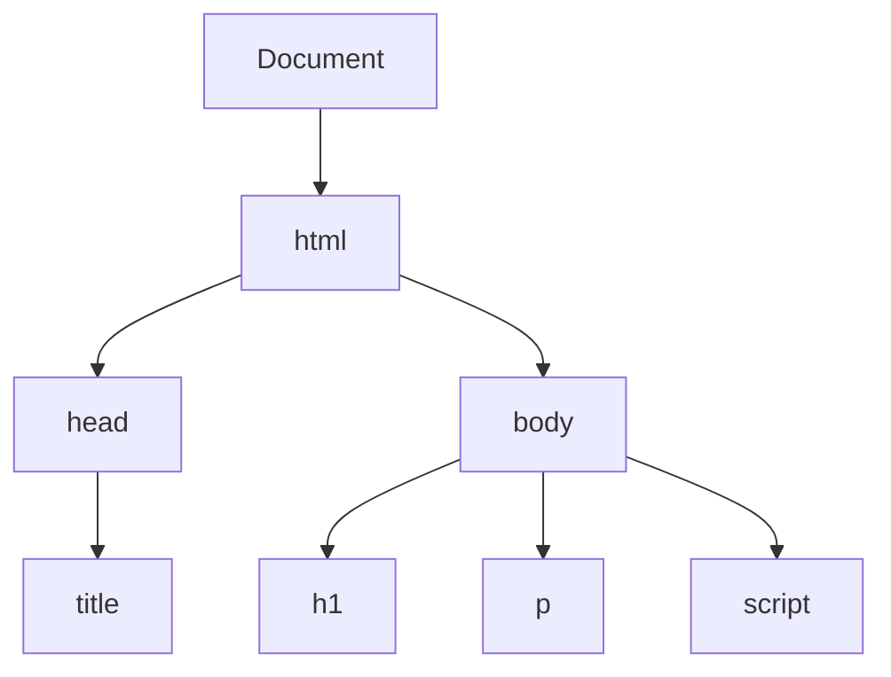

# JavaScript Basics - Adding Interactivity

[← Back to Course Home](../../)

## What is JavaScript?

JavaScript is a programming language that adds interactivity to web pages. While HTML provides structure and CSS provides styling, JavaScript makes pages dynamic and responsive to user actions.

## Adding JavaScript to HTML

### Inline JavaScript

Add JavaScript directly in HTML using the `<script>` tag:

```html
<html>
<head>
    <title>JavaScript Example</title>
</head>
<body>
    <h1>Hello!</h1>

    <script>
        alert('Welcome to JavaScript!');
    </script>
</body>
</html>
```

### Script Placement

Scripts can be placed in the `<head>` or `<body>`. For best performance, place them at the end of `<body>`:

```html
<body>
    <!-- Your HTML content -->

    <script>
        // Your JavaScript code
    </script>
</body>
```

## The DOM (Document Object Model)

JavaScript can interact with HTML elements through the DOM. The DOM represents the page as a tree of objects.

### DOM Structure Visualization

Here's how the DOM represents an HTML document:



This tree structure shows how HTML elements are nested and related to each other.

### Selecting Elements

Get elements by ID:

```javascript
let element = document.getElementById('myElement');
```

Get elements by class:

```javascript
let elements = document.getElementsByClassName('myClass');
```

Get elements by tag:

```javascript
let paragraphs = document.getElementsByTagName('p');
```

Modern selector (recommended):

```javascript
let element = document.querySelector('#myElement');
let elements = document.querySelectorAll('.myClass');
```

## Changing Content

### Change Text Content

```html
<p id="demo">Original text</p>

<script>
    document.getElementById('demo').textContent = 'New text!';
</script>
```

### Change HTML Content

```javascript
document.getElementById('demo').innerHTML = '<strong>Bold text</strong>';
```

### Change Styles

```javascript
document.getElementById('demo').style.color = 'red';
document.getElementById('demo').style.fontSize = '24px';
```

## Event Handling

Make your page respond to user actions:

### Button Click

```html
<button onclick="handleClick()">Click Me</button>

<script>
    function handleClick() {
        alert('Button was clicked!');
    }
</script>
```

### Adding Event Listeners

A better approach using JavaScript:

```html
<button id="myButton">Click Me</button>

<script>
    document.getElementById('myButton').addEventListener('click', function() {
        alert('Button was clicked!');
    });
</script>
```

## Common User Interactions

### Change Color on Click

```html
<p id="colorText">Click the button to change my color</p>
<button id="colorButton">Change Color</button>

<script>
    document.getElementById('colorButton').addEventListener('click', function() {
        document.getElementById('colorText').style.color = 'blue';
    });
</script>
```

### Show/Hide Elements

```html
<p id="toggleText">This text can be hidden</p>
<button onclick="toggleVisibility()">Toggle</button>

<script>
    function toggleVisibility() {
        let element = document.getElementById('toggleText');
        if (element.style.display === 'none') {
            element.style.display = 'block';
        } else {
            element.style.display = 'none';
        }
    }
</script>
```

### Form Handling

```html
<input type="text" id="nameInput" placeholder="Enter your name">
<button onclick="greet()">Greet Me</button>
<p id="greeting"></p>

<script>
    function greet() {
        let name = document.getElementById('nameInput').value;
        document.getElementById('greeting').textContent = 'Hello, ' + name + '!';
    }
</script>
```

## Complete Interactive Example

```html
<html>
<head>
    <title>Interactive Page</title>
</head>
<body>
    <h1 id="heading">Welcome!</h1>
    <button id="changeButton">Change Heading</button>
    <button id="colorButton">Change Color</button>

    <script>
        document.getElementById('changeButton').addEventListener('click', function() {
            document.getElementById('heading').textContent = 'You clicked the button!';
        });

        document.getElementById('colorButton').addEventListener('click', function() {
            document.getElementById('heading').style.color = 'green';
        });
    </script>
</body>
</html>
```

## Interactive Examples

Check out these working examples:
- [Button Click Example](../../Samples/button-click.html)
- [Form Handling Example](../../Samples/form-handling.html)
- [DOM Manipulation Example](../../Samples/dom-manipulation.html)

## Best Practices

1. **Use `let` or `const`** instead of `var` for variables
2. **Add event listeners** instead of inline `onclick`
3. **Separate concerns** - Keep JavaScript in `<script>` tags or external files
4. **Use meaningful function names**
5. **Add comments** to explain complex code

## Practice Exercises

1. Create a button that changes the text of a paragraph
2. Make a button that toggles an element's visibility
3. Create a simple calculator using form inputs
4. Build a color picker that changes the page background

## Next Steps

You now know the basics of HTML and JavaScript! Continue practicing and exploring:
- Build more complex interactions
- Learn about JavaScript functions and variables in depth
- Explore CSS for better styling
- Learn about external JavaScript files

---

**Navigation:** [Home](../../) | [Previous: Styling](styling)
